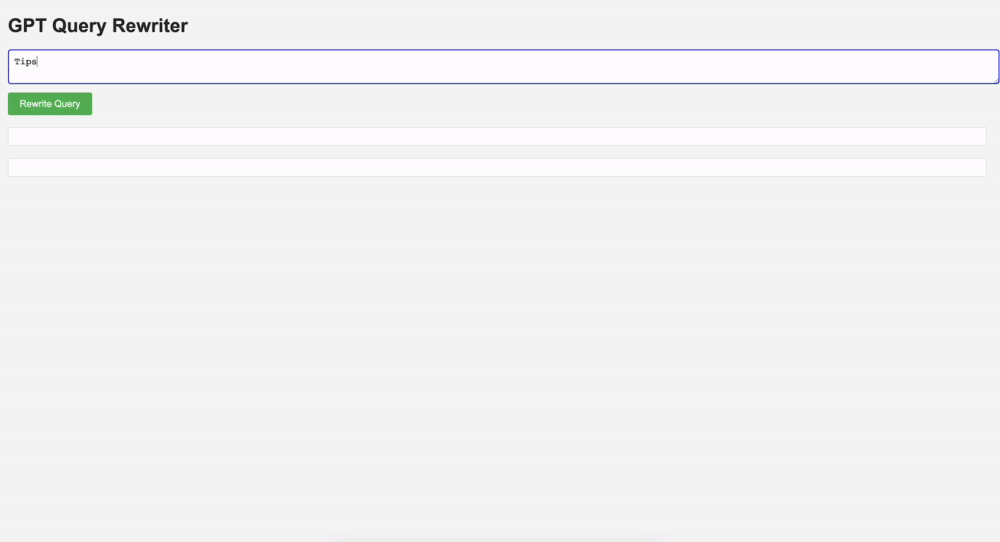
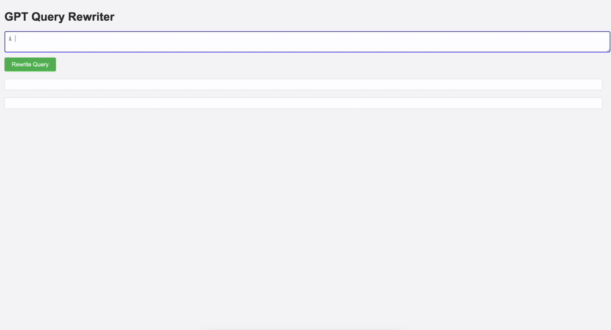

# GPT-Query-Augmentation-and-Search-
Leveraging GPT for query refinement and information retrieval from web searches.

## About
This Node.js application uses GPT-4 to optimize user search queries for Google Search. It interfaces with the OpenAI API to rewrite queries and the Google Custom Search JSON API to fetch and display the top 5 search results.


Implementation inspired by the concepts discussed in the paper: ["Query Rewriting for Retrieval-Augmented Large Language Models"](https://arxiv.org/abs/2305.14283).

## Set-Up

### Prerequisites
- Node.js installed on your machine
- An OpenAI API key for accessing GPT-4
- A Google API key and a Google Custom Search Engine ID

### Installation
1. Clone the repository to your local machine:
   ```sh
   git clone https://github.com/your-username/GPT-Query-Augmentation-and-Search-.git
   ```
2. Navigate to the cloned repository's directory:
   ```sh
   cd GPT-Query-Augmentation-and-Search-
   ```
3. Install the required Node.js packages:
   ```sh
   npm install
   ```
4. Create a `.env` file in the root directory of the project and add the following environment variables:
   ```sh
   OPENAI_API_KEY=your_openai_api_key
   GOOGLE_API_KEY=your_google_api_key
   GOOGLE_SEARCH_ENGINE_ID=your_google_search_engine_id
   ```
   Replace `your_openai_api_key`, `your_google_api_key`, and `your_google_search_engine_id` with your actual keys.

5. Start the server:
   ```sh
   node server.js
   ```
   The application should now be running on `http://localhost:3000` or another port if you've specified one in the `.env` file.

## Usage

<p align="center">
  
</p>

<p align="center">
  
</p>

### Performing a Query
1. Open your web browser and navigate to `http://localhost:3000`.
2. You will see a text area where you can enter your initial search query.
3. After entering your query, click the "Rewrite Query" button.
4. The application will process your input, rewrite the query using GPT-4, and perform a Google search with the optimized query.
5. The rewritten query and the top 5 Google search results will be displayed on the web page.